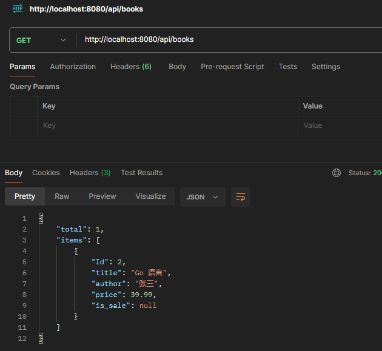

# book api
1. 构建gin引擎实对, 并且运行
2. gin引擎实对, 调用方法实现5个api, 先不实现里面的调用函数
   * List book
   ```sh
   GET /api/books
   ```
   * Create book
   ```sh
   POST /api/books
   ```
   * Get book by book number
   ```sh
   GET /api/books/:bn
   ```
   * Update book
   ```sh
   PUT /api/books/:bn
   ```
   * Delete book
   ```sh
   DELETE /api/books/:bn
   ```
3. 在5个api接口里面获取用户的请求参数, 处理, 持久化, 响应.
   * List book使用GET方法, 请求参数在(1)querystring
   * Create book使用POST方法, 请求参数在(1)body
   * List book by number使用GET方法, 请求参数在(1)uri
   * Update book使用PUT方法, 请求参数(1)uri (2)body
   * Delete book使用Delete方法, 请求参数(1)uri
4. 改造成bookapihandler定义以上5个接口
5. 定义book结构体, 映射打tag 映射gorm; 创建TableName方法, 里面是映射的表名;创建db变量, 以后这个就是句柄
6. 利用数据库进行crud
   * ListBook:
      * 如何查询一个数据的列表. 如果返回1万条, 要使用分页. 还要获取总数
      * 为了获取分页总数, 还需要定义分页总数的对象
      * 按照关键字过滤
      * 统计总数, 定义用分页的结构对象, 返回的对象既可以返回total数, 也可以返回查询的结果.
      * 如果不传pageSize和pageNumber应该有默认值
   createBook:
      * 拆结构体, 因为id不需要用户来传, 用户传的字段参数仅仅是bookspec.
      * 数据持久化, 构造book结构类实对, orm在save的时候自动填充id字段.
      * 当创建记录时,怎么判断字段是否为空.
      * 创建成功返回http.StatusCreated
   GetBook:
      * 通过拿到的booknumber,对数据库查找
      * 将找到的对象返回
   UpdateBook:
      * 通过booknumber知道要更新哪一条记录
      * 通过BindJSON知道要更新的内容
      * 通过Where查找,并且更新
   DeleteBook:
      * where通过bn查找条目,删除记录
      * 返回http.StatusNoContent
7. go run main.go 运行,可以看到连接了数据库,创建了表
8. curl 连接api测试
   * api里面json串的key是mysql数据库的字段名
   * CreateBook
   ```sh
   curl -X POST http://localhost:8080/api/books -H "Content-type: application/json" -d '{"title":"Go 语言", "author":"张三", "price":39.99}'
   ```
   

   * ListBooks
   注意pageSize和pageNumber为空
   ```sh
   curl http://localhost:8080/api/books
   ```
   

   * GetBook
   ```sh
   curl http://localhost:8080/api/books/1
   ```
   

   * UpdateBook
   ```sh
   curl -X PUT http://localhost:8080/api/books/1 -H "Content-type: application/json" -d '{"title":"Go 语言进阶", "author":"张三", "price":49.99}'
   ```
   

   * DeleteBook
   ```sh
   curl -X DELETE http://localhost:8080/api/books/1
   ```
   


   


[def]: ./GetBook.png